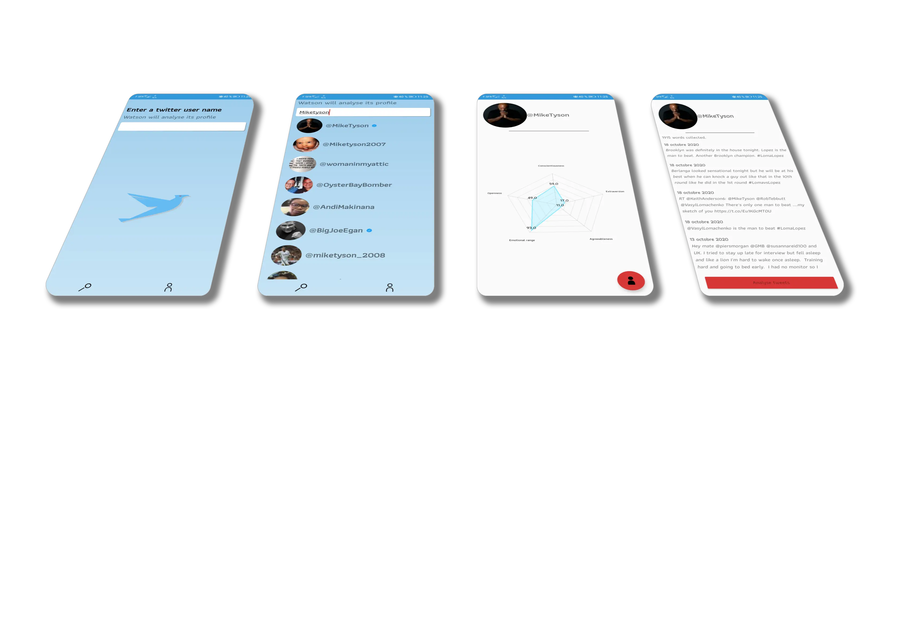

<h1 align="left">BigWatson</h1>

Last updated on 23 Oct 2020

<h4>Data analysis coupled with artificial intelligence has become common practice in our society. BigWatson performs personality analysis based on the BigFive method from tweets posted by a user.
This application is a proof of concept and is in no way intended for use by the general public.</h4>

___

## Technical features

- Language : **Kotlin**
- **MVVM** architecture
- Dependency injection with **Dagger.Hilt**
- Data persistence on SQLite database with **Room**
- **Dynamic canvas chart** with MPcharts
- Asynchronous work using in **Coroutines** with **Twitter** and **Watson AI** APIs.
